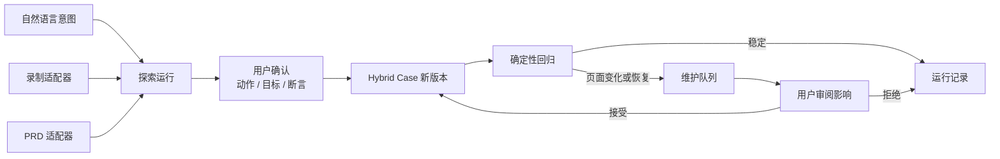
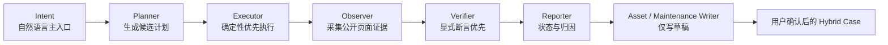

# 自动化测试 Agent 目标设计

## 1. 最终定位

TestBuddy 的目标是成为一个面向单个使用者、运行在本地桌面端的 Web UI 智能自动化测试工具。

它不是让 Agent 每次临场决定全部操作，也不是把自然语言直接翻译成一段不可审阅脚本。它要解决的是：

> 用自然语言低成本探索业务路径，再用用户确认的结构化资产长期、稳定地执行回归。

自然语言是主入口。录制和 PRD/PDF 是输入适配器，为自然语言意图补充真实操作和需求原文，最终统一生成 Hybrid Case 草稿。

当前实现已经打通 `Intent -> Plan -> Execute -> Observe -> Verify -> Report` 的基础链路，并具备运行记录、录制、PRD 和 CLI 基线。目标设计在此基础上把资产契约、确定性执行、Suite 和维护闭环收敛为产品主线。

## 2. 核心对象：Hybrid Case

### 2.1 为什么不是纯脚本或纯 Agent

纯脚本确定但创建门槛高，页面小幅变化后维护成本高；纯 Agent 进入门槛低，但每次重新解释目标，结果和成本不够稳定。

Hybrid Case 把两者边界固定下来：

- 业务意图保留自然语言的可读性。
- 动作和目标在用户确认后结构化，保证可复跑。
- 断言显式版本化，避免模型在运行时改变通过标准。
- AI 仅处理探索、受控恢复和复杂判断。

### 2.2 资产组成

每个 Hybrid Case 包含：

```text
Case
├── identity
│   ├── stable id
│   ├── title
│   └── version
├── intent
│   ├── business goal
│   ├── preconditions
│   └── success meaning
├── actions
│   ├── typed action
│   ├── confirmed target
│   ├── locator fingerprint
│   ├── input source
│   └── risk level
├── assertions
│   ├── stable assertion id
│   ├── explicit version
│   ├── expected value
│   └── evidence contract
├── dependencies
│   ├── fixture versions
│   ├── reusable flow versions
│   └── baseline versions
└── provenance
    ├── natural language run
    ├── optional recording nodes
    └── optional PRD excerpts
```

业务意图用于解释资产，不替代动作和断言；定位指纹用于重新找到同一目标，不授权改变目标；provenance 用于追溯，不决定运行结果。

### 2.3 生命周期



任何探索或恢复结果都不能绕过“用户确认”直接修改 `H`。

## 3. Agent 能力闭环

完整闭环仍采用：



与传统“全程 Agent”不同，已保存回归用例从结构化 Case 进入 Executor，不要求每次先经过模型 Planner。

### 3.1 Planner

Planner 用于：

- 把自然语言意图拆成候选动作和断言。
- 将录制节点与 PRD 原文合并进同一候选计划。
- 标记前置 fixture、认证和高风险动作。
- 在确定性定位失败且满足恢复条件时，基于当前页面生成等价候选。
- 为复杂判断声明所需证据，而不是直接宣称通过。

Planner 不负责：

- 在 Suite 回归时重新解释已经确认的业务意图。
- 修改断言期望值以适应当前页面。
- 把高风险动作替换成业务含义不同的动作。
- 自动写回 Case、fixture、公共流程或基线。

### 3.2 Executor

Executor 按以下优先级执行：

1. 已确认的结构化动作。
2. 定位指纹中的确定性备用候选。
3. 满足策略时的 AI 恢复候选。
4. 无等价候选时停止并报告。

核心动作包括 navigate、click、input、select、wait、scroll、assert，以及 iframe、tab、upload、download、hover、drag、clipboard 等 Web 交互。

Executor 必须记录：

- 实际执行的动作和目标。
- 使用的定位信号及质量。
- 与 Case 原目标是否等价。
- 重试、恢复和 AI 介入情况。
- 动作副作用和高风险保护结果。

### 3.3 Observer

Observer 只采集完成动作和断言所需的最小证据：

- URL、标题和页面生命周期。
- 语义 HTML、ARIA 和公开 DOM 摘要。
- 目标及其上下文定位指纹。
- 截图、trace 和必要的视觉区域。
- console 和 network 关键信号。
- iframe、tab、upload/download 和 clipboard 事件。
- 表格、图表及其他组件的完整度标记。

Observer 对证据给出 `complete`、`partial` 或 `unknown` 完整度。全量断言不能从局部可见样本推断通过。

### 3.4 Verifier

Verifier 依次执行：

1. 显式确定性断言。
2. 结构化 DOM / network / download / baseline 断言。
3. 仅对明确标记的复杂判断调用 AI。

显式断言必须带版本。运行记录要保存使用的断言版本和实际证据，确保未来可以解释“当时按什么标准判定”。

AI Verifier 必须：

- 只读取脱敏后的最小证据。
- 返回结论、证据引用和无法判断原因。
- 证据不足时产生 `blocked` 或 `error` 所需的结构化原因，不能默认 `passed`。
- 不修改断言或基线。

### 3.5 Reporter

Reporter 负责把执行事实归一为用户可读结果：

- 运行终态和 flaky 标记。
- 失败、阻塞、跳过、取消或基础设施错误原因。
- 动作、定位、断言和证据链。
- AI 介入点、输入证据和恢复结果。
- fixture setup / cleanup、认证和资源锁信息。
- 维护候选及影响范围。

Reporter 的自由文本只用于解释，不能成为可执行恢复指令。

### 3.6 Asset / Maintenance Writer

Writer 只能创建草稿：

- 首次探索形成 Case 草稿。
- AI 恢复形成定位维护草稿。
- 复杂判断变化形成断言维护草稿。
- 公共流程升级形成引用升级草稿。
- 基线差异形成基线审阅草稿。

草稿必须显示原版本、新候选、证据、变更原因和影响范围。只有用户接受后才创建新资产版本。

## 4. 确定性与 AI 的责任边界

### 4.1 确定性优先矩阵

| 场景 | 默认执行者 | AI 介入条件 |
| --- | --- | --- |
| 已确认 click/input/select | 结构化 Executor | 公开定位信号失效且允许恢复 |
| URL、文本、属性、network 断言 | 规则 Verifier | 不介入 |
| 表格全量、下载内容 | 结构化 Verifier | 证据结构无法可靠解析且 Case 显式允许 |
| 复杂图表或视觉语义 | 显式 AI Verifier | Case 已声明并具备所需证据 |
| 首次自然语言探索 | Planner + Executor | 默认允许 |
| 保存/更新资产 | 用户确认 | AI 只能生成草稿 |

### 4.2 恢复约束

AI 恢复必须同时满足：

- 候选目标与原目标的角色、名称、上下文和业务作用等价。
- 不改变输入来源或输入值。
- 不放宽、删除或替换断言。
- 不重放可能已经产生副作用的动作，除非动作被证明幂等且策略允许。
- 不跨项目、环境、账号或资源锁边界。
- 生成结构化恢复证据。

不满足时停止。断言失败始终停止并报告，不能通过重规划绕过。

### 4.3 高风险动作边界

高风险动作包括提交、删除、支付、审批、发消息和修改生产数据。

对这些动作：

- 探索阶段需要显式确认或预先授权的安全策略。
- 恢复只能寻找同一业务对象上的等价控件。
- 不允许把“提交草稿”改成“发布”，把“删除测试记录”改成“删除全部”，或切换到其他账号/租户完成操作。
- 无法证明等价时标记 `blocked`；已执行但业务断言失败时标记 `failed`。

## 5. 定位设计

### 5.1 页面契约

TestBuddy 不把 `data-testid` 作为被测应用的接入要求。首选契约是：

- 语义 HTML。
- ARIA role、accessible name、state 和 relationship。
- 公开 DOM 中稳定的业务属性、表头、链接和表单关系。
- 目标所在页面、landmark、容器标题、相邻文本和父子关系。

框架私有 class、绝对 XPath、像素坐标和 DOM 序号属于低质量信号，不应成为长期资产的唯一定位方式。

### 5.2 上下文定位指纹

定位指纹至少包含：

- 页面 URL/path 或路由特征。
- 目标 role、accessible name、label、text 和公开属性。
- 所属 landmark、dialog、form、table/chart title。
- 邻近标题、描述或稳定业务文本。
- 匹配数量和选择理由。
- 用户确认时的备用候选。

目标执行时先评估定位质量。质量下降但仍能确定等价目标时可以继续运行并进入维护队列；无法可靠唯一定位时进入 AI 恢复或停止。

### 5.3 定位质量

定位质量至少区分：

- `strong`：稳定语义/公开属性唯一匹配。
- `acceptable`：多个公开信号组合后唯一匹配。
- `weak`：依赖易变文本、结构位置或私有 class。
- `unresolved`：无法证明唯一或等价。

`weak` 和 `unresolved` 不能被静默保存为长期回归目标。

## 6. Fixtures、认证与环境

### 6.1 Typed fixture contract

Fixture 是版本化 project asset，声明：

- 输入、输出和类型。
- setup / cleanup。
- 凭证引用。
- 资源锁。
- 超时和失败策略。
- HTTP、UI 或 trusted script 执行方式。

默认优先使用 HTTP setup / cleanup。HTTP 调用必须记录 endpoint 模式、状态和脱敏摘要；秘密值不进入资产或报告。

### 6.2 Trusted script

自定义脚本需要显式信任。脚本路径或内容哈希变化会使既有信任失效。未信任时不执行，并将相关测试标记为 `blocked`。

### 6.3 认证

- 浏览器登录态使用 `storageState`。
- Case 和 fixture 只引用认证配置。
- `storageState` 与凭证保存在 `studio-data/credentials`，不进入 project directory。
- 认证失效不等于业务断言失败，应归类为 `blocked`。

## 7. Suite 与公共流程

### 7.1 Suite Runner

Suite 面向本地 10–100 case 规模。

Runner 负责：

- 解析 Case、fixture、公共流程和基线的固定版本。
- 建立依赖图。
- 在本机资源范围内有限并发。
- 对账号、租户、环境、fixture 等共享资源加锁。
- 归一桌面端与 CLI 的选取、调度、重试、取消和结果。
- 运行结束后退出，不依赖后台 daemon。

桌面端与 CLI 不能各自推导状态或实现第二套 Runner。

### 7.2 Reusable flow

公共流程使用不可变版本：

- Case 固定引用 `flowId@version`。
- 修改产生新版本，不原地覆盖。
- 升级前列出受影响 Case、Suite、fixture 和 baseline。
- 用户确认后才批量更新引用。
- 运行记录保存实际解析到的公共流程版本。

## 8. 状态与 flaky 模型

运行终态统一为：

- `passed`：动作和必需断言全部通过。
- `failed`：被测业务行为或断言不符合预期。
- `blocked`：环境、凭证、信任、前置条件或资源阻止执行。
- `skipped`：由选择或依赖策略明确跳过。
- `cancelled`：收到取消请求并完成受控停止。
- `error`：Runner、浏览器、文件或基础设施异常。

`flaky` 是独立布尔标记及原因集合，不覆盖终态。

关键归类规则：

- 断言不满足是 `failed`，不是 `error`。
- 模型/浏览器不可用且用例确实依赖它们时是 `blocked` 或 `error`，不能用“中性通过”替代。
- 未执行的依赖后续用例是 `skipped`，不是伪造的 `passed`。
- 用户取消是 `cancelled`，并保留已完成步骤。
- 重试后通过仍为 `passed + flaky`；报告必须显示原失败证据。

## 9. 交互和判断范围

### 9.1 浏览器支持

- Chromium：稳定支持和完成定义的验收浏览器。
- Firefox / WebKit：实验性，单独展示兼容结果和已知限制。

### 9.2 Web 交互

目标范围：

- iframe。
- tab / popup。
- upload / download。
- hover。
- drag and drop。
- clipboard。
- 网络请求与响应断言。
- 显式 network mock。

mock 必须作为可审阅配置出现，记录匹配条件、响应和启用范围；隐式 mock 会破坏真实回归语义，因此禁止。

## 10. 维护、安全与数据生命周期

### 10.1 维护队列

队列汇总定位质量下降、AI 恢复、断言证据变化、基线差异、fixture/认证问题、公共流程升级和 flaky 用例。

队列的目标不是自动修复，而是把一次运行中的变化转换成：

- 可重现证据。
- 最小变更候选。
- 受影响资产清单。
- 用户可接受或拒绝的版本草稿。

### 10.2 数据边界

- project directory 保存 cases、suites、fixtures、reusable flows 和 baselines。
- `studio-data` 保存 runs、artifacts、credentials 和 cache。
- project directory 可由外部 Git 管理；TestBuddy 不提供内置 Git。
- AI 恢复和运行产物不能直接覆盖 project asset。

### 10.3 脱敏与保留

- 凭证、token、cookie、Authorization 和用户标记字段在持久化、导出和模型调用前脱敏。
- 截图、trace 和下载按类型配置保留策略。
- 被固定、被维护草稿引用或作为基线的产物不自动清理。
- 清理运行数据不影响 project asset 和凭证独立生命周期。

## 11. 当前阶段差距

### 11.1 已有基础

- 本地 Electron/React 工作台和受控 IPC。
- 自然语言、Workflow、Recording 的统一 Agent Run 基础。
- BrowserRuntime、Planner、Observer、Verifier、Reporter 和 artifact 基础。
- 结构化动作、有限恢复、断言失败停止、证据和报告。
- 录制和 PRD 输入、运行转用例、桌面/CLI 执行入口。

### 11.2 与目标设计的主要差距

- 现有用例仍需迁移到 Hybrid Case V2 的意图、定位指纹和断言版本契约。
- 长期资产仍需从 `studio-data/state.json` 拆到 project directory。
- 当前 `running/passed/failed/neutral` 需要迁移为明确终态和独立 flaky 标记。
- Typed fixtures、`storageState` 生命周期和脚本信任尚未形成完整产品闭环。
- Suite 的 10–100 case 调度、有限并发和资源锁需要统一 Runner。
- 公共流程需要固定版本和影响分析。
- 维护队列、脱敏覆盖和保留策略需要形成可验收界面与数据契约。
- iframe、tab、upload/download、hover、drag、clipboard、network assertion/mock 需要补齐。
- Firefox/WebKit 只能在实验性范围推进；Chromium 先满足稳定性门禁。

## 12. 完成定义

目标设计只有在以下四项共同达成后才可称为可用产品：

- 用户可在 15 分钟内完成首个 Hybrid Case。
- 同一 20 case Suite 在桌面端和 CLI 的 Runner 语义与结果口径一致。
- 稳定页面在等价环境下连续 10 轮达到至少 95% 干净通过率。
- 页面变化会形成保留原资产、证据和影响范围的维护草稿，不发生自动资产改写。

具体实施依赖按 `Regression Case V2 -> Project Asset Store -> Fixtures/Auth -> Suite Runner -> Reusable Flows -> Maintenance/Safety -> Interaction Breadth -> Real Acceptance` 推进，见 [实施路线图](./implementation-roadmap.md)。

## 13. 非目标

目标设计不包含多人/RBAC、云同步、分布式执行、内置 Git、完整 API 测试、移动端、性能测试、验证码绕过或跨桌面应用自动化。
