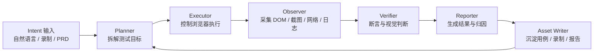

# 自动化测试 Agent 目标设计

## 1. 最终定位

PlayTest Pro 的最终目标是成为一个面向 Web 应用的本地自动化测试 Agent。

它不是单纯的测试管理系统，也不是脚本编辑器，而是一个能理解测试目标、操作浏览器、观察页面状态、判断结果并沉淀资产的智能测试工作台。

目标用户可以通过三种方式发起测试：

- 用自然语言描述要验证的业务路径。
- 录制真实用户操作路径，再作为回放和对比依据。
- 导入 PRD/PDF，由系统分析需求并生成测试路径。

Agent 的输出不是一段孤立脚本，而是一组可维护资产：

- 测试路径
- 测试用例
- 录制资产
- 执行记录
- 截图、trace、日志和报告
- 失败原因分析与修复建议

## 2. Agent 能力闭环

一个完整测试 Agent 必须具备以下闭环：

### 2.1 Planner

Planner 负责把输入转成可执行计划。

输入：

- 用户自然语言指令
- PRD 文本或 PDF 抽取内容
- 录制路径
- 项目环境、账号、默认上下文

输出：

- 测试目标
- 步骤列表
- 每步动作类型
- 断言点
- 风险点和优先级
- 需要的前置条件

### 2.2 Executor

Executor 负责真实控制浏览器。

核心能力：

- 打开目标 URL
- 点击、输入、等待、滚动、选择
- 调用 Midscene 完成语义定位
- 对图表和表格页面执行稳定操作
- 对失败步骤做有限重试和重新定位

### 2.3 Observer

Observer 负责采集执行现场。

采集内容：

- 页面截图
- DOM 摘要
- 当前 URL 和标题
- 控件定位信息
- console/network 关键信号
- 录制事件

### 2.4 Verifier

Verifier 负责判断是否通过。

判断维度：

- 文本断言
- DOM 状态断言
- 表格行列数据断言
- 图表展示状态断言
- 视觉变化对比
- PRD 覆盖点是否满足

### 2.5 Reporter

Reporter 负责输出可读结论。

输出内容：

- 本次执行是否通过
- 哪一步失败
- 失败截图和 trace
- 失败原因推断
- 可能的修复建议
- 可复用测试资产建议

## 3. 产品形态

应用主体仍是工作台，但所有页面都服务于 Agent 闭环。

### 3.1 启动屏

首次加载显示独立启动屏。

职责：

- 引导用户配置 Midscene
- 允许跳过
- 说明跳过后依赖 Midscene 的功能会再次触发配置
- 跳过或配置完成后后续加载不再自动显示

### 3.2 首页

首页是 Agent 总览。

职责：

- 展示项目质量状态
- 展示最近 Agent 执行结果
- 展示测试资产统计
- 提供核心入口

首页不负责复杂编辑。

### 3.3 项目与分组

项目是一级管理维度，分组是项目内二级维度。

项目维护：

- 应用 URL
- 环境
- 登录凭证引用
- 默认浏览器配置
- 默认上下文

分组维护：

- 按业务域、模块或页面集合组织测试资产
- 支持独立新增、编辑、删除

### 3.4 自然语言测试

自然语言测试是 Agent 的即时探索入口。

目标：

- 用户输入一句话
- Agent 打开/操作页面
- 返回执行过程和判断结果
- 用户可把有效指令保存为用例步骤

### 3.5 录制回放

录制回放是路径采集入口。

目标：

- 用户操作真实页面
- 系统记录路径
- 回放时对关键节点做对比
- 可转成正式测试用例

### 3.6 PRD 分析

PRD 分析是测试路径生成入口。

目标：

- 支持 PDF、Markdown、文本
- 自动提取功能点、状态、边界和验收标准
- 生成测试路径
- 生成用例和录制草稿

### 3.7 运行记录

运行记录是 Agent 结果中心。

目标：

- 按项目、分组、用例、环境查看结果
- 展示执行步骤、截图、日志、trace
- 展示失败归因
- 展示运行耗时、模型调用量、token 用量和重规划配置
- 支持后续复跑和对比

## 4. 当前阶段差距

当前已经具备：

- 应用壳与工作台 UI
- 项目、分组、用例、录制、PRD、运行记录数据模型
- Midscene 配置和启动屏
- Electron runtime、浏览器 runtime、录制事件和回放 runner 雏形
- PRD 到路径/用例/录制草稿的基础规则化链路
- 统一 Agent Run 数据结构、轻量 Observer 与最小 Verifier
- semantic click / input / assert 可替换执行 contract
- Midscene PlaywrightAgent adapter 与当前受控浏览器 Page 装配
- Midscene HTML 报告 artifact、结构化事件和运行记录入口
- Midscene 单动作耗时与 usage 差值归档，失败动作也会保留已产生的指标
- Workflow 顺序执行、失败停止和父级 Agent Run 聚合，浏览器 fallback 不再模拟通过
- Recording 直接回放、逐节点 Agent 事件、基线/实际截图证据配对和运行记录持久化
- 本地交易 Demo 的真实浏览器加载、下拉交互和页面状态观察基线

距离完整 Agent 还缺：

- Midscene 真实模型与业务页面验收
- Agent Planner
- 实际重规划次数与更细粒度的步骤成本分析
- Observer 深层采集能力
- 表格、图表和视觉 Verifier
- 失败归因和报告生成
- PRD LLM 分析
- 图表/表格专用断言能力
- Planner 失败重试与基于最新页面状态的动态重规划

## 5. MVP Agent 定义

第一阶段不追求完全自主，而是打通最小闭环：

1. 用户在自然语言页输入测试目标。
2. 系统启动受控浏览器。
3. Agent 生成计划并执行。
4. 每一步产生日志和截图。
5. Agent 给出通过/失败判断。
6. 结果写入运行记录。
7. 有效步骤可保存为用例。

MVP 验收标准：

- 至少能对一个真实 Web 页面完成打开、点击、输入和断言。
- 失败时能指出失败步骤，并保存截图。
- 运行结果能在运行记录页查看。
- Midscene 未配置时仍保持当前设置拦截逻辑。

## 6. 工程原则

- UI 不直接调用模型或 Playwright。
- Renderer 只表达意图和展示结果。
- Main Process 持有 runtime、密钥、文件和浏览器控制权。
- Agent 过程必须可追踪，每一步都要有结构化事件。
- 任何自然语言生成的测试资产都必须可编辑。
- 所有自动化结果都必须可复跑、可归档、可解释。
