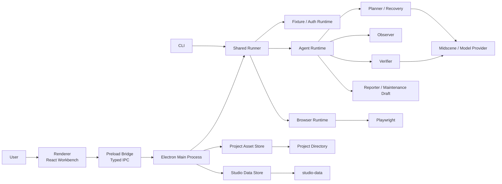
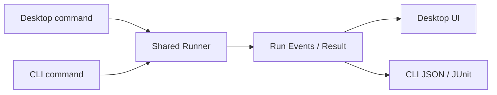

# 系统架构设计

## 1. 架构目标与当前边界

TestBuddy 采用 Electron 多进程架构，服务于单人、本地 Web UI 自动化测试。

目标架构需要同时保证：

- 自然语言探索可以低门槛进入浏览器执行。
- 用户确认后的 Hybrid Case 以确定性方式长期回归。
- project asset 与运行时数据物理分离。
- 桌面端和 CLI 使用同一 Runner。
- AI 只能生成计划、恢复候选、复杂判断和维护草稿，不能自动修改资产。
- 本机支持 10–100 case Suite 的有限并发和资源锁，不依赖后台 daemon。

当前代码已经具备 Renderer、Preload、Main Process、BrowserRuntime、Agent 角色、运行记录、artifact 和 CLI 基础，但仍以 `studio-data/state.json` 与 `running/passed/failed/neutral` 为主。本文描述目标边界；迁移过程必须兼容读取既有数据，并在写入新资产前完成显式升级。

## 2. 总体架构



调用方向固定为：

- Renderer 只表达意图、审阅资产和展示结果。
- Preload 只暴露 typed IPC 白名单。
- Main Process 持有文件、凭证、模型和进程权限。
- Desktop 与 CLI 都调用 Shared Runner。
- Runner 协调 fixture、资源锁、BrowserRuntime 和 AgentRuntime。
- Project Asset Store 与 Studio Data Store 不共享隐式写入。

## 3. 进程职责

### 3.1 Renderer

Renderer 负责：

- project directory 选择和资产编辑。
- 自然语言探索、录制和 PRD 输入。
- Hybrid Case 动作、目标和断言确认。
- Suite、fixture、公共流程和 baseline 管理。
- 运行、状态、flaky、证据和维护队列展示。
- 通过 IPC 发起桌面运行和取消。

Renderer 不负责：

- 直接访问 Playwright 或模型。
- 直接读取凭证、`storageState` 或任意本地路径。
- 推导最终运行状态。
- 执行 fixture 脚本。
- 自动接受 AI 恢复或维护草稿。

### 3.2 Preload Bridge

Preload 只暴露按领域划分的 typed API：

- project asset 读取、校验和显式保存。
- suite/case 运行、取消和事件订阅。
- 浏览器探索与录制会话。
- PRD/录制适配器分析。
- artifact 受控打开和导出。
- credential / `storageState` 引用管理。
- trusted script 信任确认。
- maintenance draft 接受或拒绝。

每个 IPC 请求都需要校验 project、run 和本地路径作用域。Renderer 传入的任意路径不能直接进入文件系统调用。

### 3.3 Main Process

Main Process 负责：

- Electron 生命周期和 IPC 注册。
- project directory 授权与路径约束。
- Project Asset Store / Studio Data Store 实例。
- Shared Runner 生命周期。
- BrowserRuntime、模型调用和 artifact 管理。
- 凭证加密、脚本信任和保留策略。
- Desktop Run 事件转发。

Main Process 不作为常驻测试 daemon。桌面应用退出后不继续后台调度 Suite；CLI 命令结束后 Runner 进程退出。

### 3.4 CLI

CLI 负责：

- 解析稳定的 project、suite、case 和 environment 标识。
- 加载与桌面端相同的资产契约。
- 调用同一 Shared Runner。
- 输出结构化 JSON、JUnit 等报告适配。
- 使用相同状态、flaky、资源锁、fixture 和保留语义。

CLI 不实现独立的执行分流或状态映射。

## 4. 资产与数据架构

### 4.1 Project Asset Store

Project Asset Store 管理用户选择的 project directory：

```text
<project-directory>/
  project.json
  cases/
  suites/
  fixtures/
  reusable-flows/
  baselines/
```

职责：

- 读取、解析和校验资产 schema。
- 保持稳定 ID、显式版本和引用完整性。
- 使用原子写入保存用户确认的变更。
- 在公共流程、fixture、断言或 baseline 升级前计算影响范围。
- 保留兼容迁移信息，但不在运行时静默升级资产。

Project Asset Store 不管理 Git。外部 Git 可以观察这些普通文件；应用不能假设目录一定是 Git repository。

### 4.2 Studio Data Store

Studio Data Store 管理应用私有运行数据：

```text
studio-data/
  runs/
  artifacts/
    screenshots/
    traces/
    downloads/
    diffs/
    reports/
  credentials/
    storage-states/
  cache/
```

职责：

- 保存运行摘要、步骤状态和证据索引。
- 管理截图、trace、下载、diff 和报告。
- 加密保存凭证和 `storageState`。
- 保存可重建缓存和临时解析结果。
- 执行按类型配置的保留策略。

`studio-data` 中的恢复结果只能形成 maintenance draft。接受草稿时，由用户动作触发 Project Asset Store 创建新版本。

### 4.3 引用规则

- Project asset 可以引用 credential/storageState 的逻辑 ID，不能保存秘密内容或绝对私有路径。
- Run 必须保存实际解析到的 Case、assertion、fixture、flow 和 baseline 版本。
- Artifact 可以被 Run 和 maintenance draft 引用。
- 保留策略不能删除仍被固定、baseline 或 maintenance draft 引用的 artifact。
- 删除/移动 project asset 前必须检查 Suite、flow、fixture 和 baseline 引用。

### 4.4 迁移边界

当前 `studio-data/state.json` 中的项目、用例和录制等数据属于旧存储模型。迁移到 project directory 时需要：

1. 只读解析旧数据。
2. 生成待审阅迁移预览。
3. 分配/保留稳定 ID 和初始版本。
4. 写入新的 project asset。
5. 校验引用和可执行性。
6. 用户确认后切换项目指针。

迁移失败不能覆盖旧状态，也不能把 run/artifact/credential 复制进 project directory。

## 5. Hybrid Case V2 架构

### 5.1 Case contract

目标 Case contract 至少包含：

```text
HybridCase
  id
  version
  intent
  preconditions
  actions[]
  assertions[]
  fixtureRefs[]
  reusableFlowRefs[]
  baselineRefs[]
  provenance[]
```

- `intent`：业务目标和成功语义。
- `actions`：用户确认的 typed action、target fingerprint、input source 和 risk。
- `assertions`：稳定 ID、显式版本、期望和 evidence contract。
- `*Refs`：固定引用具体资产版本。
- `provenance`：自然语言 run、录制节点或 PRD 摘录。

运行时生成的 selector、模型建议或临时等待不能直接回写该 contract。

### 5.2 Assertion contract

断言分为：

- DOM/URL/text/attribute。
- network request/response。
- table/grid structured data。
- chart/visual semantic。
- download/file。
- baseline comparison。

每条断言需要：

- 稳定 ID 和版本。
- 类型、目标和期望。
- 证据完整度要求。
- 是否允许 AI 判断。
- 变更原因和来源。

断言失败停止恢复链路。Planner 不能修改期望或删除断言来获得通过。

### 5.3 Target fingerprint

目标定位不要求 `data-testid`。指纹优先保存：

- semantic HTML。
- ARIA role/name/state/relationship。
- 公开 DOM 的稳定 ID、表单、链接、表头和业务属性。
- route、landmark、dialog/form/table/chart title。
- 邻近标题或说明。
- 确认时的匹配数量和备用候选。

同时保存定位质量 `strong/acceptable/weak/unresolved`。框架私有 class、绝对 XPath、位置索引和坐标只能作为低质量补充信号。

## 6. Shared Runner

### 6.1 生命周期

Runner 的生命周期与一次桌面 Run 或 CLI 命令一致：

```text
Load assets
-> Validate graph
-> Acquire resources
-> Setup fixtures/auth
-> Execute cases
-> Cleanup fixtures
-> Finalize results/artifacts
-> Exit
```

不启动后台 daemon，不保留脱离应用/命令的隐式调度状态。

### 6.2 Suite graph

Runner 在执行前解析：

- 10–100 个 Case 的选择和顺序依赖。
- fixture setup/cleanup 依赖。
- reusable flow 固定版本。
- baseline 和 credential 引用。
- account、tenant、environment、fixture 等资源锁。
- 浏览器项目和实验性标记。

引用缺失、循环依赖、未信任脚本和过期认证在浏览器启动前尽早转为 `blocked` 或 `error`，并给出具体资产路径。

### 6.3 有限并发与资源锁

- 并发上限由用户配置和本机资源共同约束。
- 没有显式证明可并发的 fixture 默认保守串行。
- 同一资源锁同一时刻只允许一个持有者。
- 取消等待锁的 Case 进入 `cancelled`，不伪装成 `skipped`。
- lock timeout 属于 `blocked`；Runner 内部锁实现异常属于 `error`。

### 6.4 Desktop / CLI 一致性

Shared Runner 是唯一状态和调度来源。Renderer 与 CLI 只是适配器：



两端使用相同的 Case selection、fixture、flow、锁、重试、取消和终态聚合。

## 7. Fixture 与认证架构

### 7.1 Typed fixture

Fixture contract 声明：

- ID、版本、typed input/output。
- setup / cleanup。
- credential reference。
- execution mode：`http`、`ui` 或 `trusted-script`。
- timeout、retry 和 resource locks。

默认使用 HTTP setup/cleanup。HTTP 响应只保留脱敏摘要和必要输出，不能把秘密响应整体写入 Run。

cleanup 在 setup 部分成功或 Case 失败/取消后仍应尽力执行。Case 终态与 cleanup 结果分别保存，避免 cleanup error 掩盖原业务失败。

### 7.2 Script trust store

Script trust 记录保存在 `studio-data`，至少绑定：

- project directory identity。
- script relative path。
- content hash。
- 用户确认时间。

路径或内容变化后需要重新信任。未信任脚本不会执行，相关 Case 为 `blocked`。

### 7.3 Authentication

- Playwright `storageState` 是浏览器认证复用格式。
- 凭证和 storageState 由 Main Process 加密保存。
- project asset 只保存逻辑引用。
- Runner 在执行前验证引用、有效期和目标环境。
- 认证过期归为 `blocked`；解密或文件损坏归为 `error`。

## 8. Agent Runtime 分层

### 8.1 Planner / Recovery

Planner 只在首次探索、明确的 AI 步骤或受控恢复时运行。

恢复输入包括原 Case 目标、当前位置、定位指纹、已执行副作用、断言和脱敏观察；输出必须是结构化等价候选及理由。

### 8.2 Executor

Executor 负责：

- Chromium 稳定路径。
- Firefox/WebKit 实验路径。
- navigate/click/input/select/wait/scroll/assert。
- iframe/tab/upload/download/hover/drag/clipboard。
- network assertion 和显式 mock。
- 动态等待、有限重试和高风险动作门禁。

mock 必须来自 project asset 的显式规则，并在 Run 中记录启用范围。Runtime 不得为提高通过率自动 mock 网络。

### 8.3 Observer

Observer 负责：

- DOM/ARIA/公开属性和 target fingerprint 证据。
- URL/title/text/console/network。
- iframe/tab/download/clipboard 生命周期。
- table/chart/visual 结构和证据完整度。
- screenshot/trace 等 artifact 引用。

### 8.4 Verifier

Verifier 先执行确定性断言。只有 Assertion contract 显式允许且确定性证据不足以表达业务语义时，才调用 AI Verifier。

AI 结果必须引用证据；无法判断不能映射为 `passed`。

### 8.5 Reporter / Maintenance

Reporter 归一终态、flaky 和证据。Maintenance Writer 从结构化失败分类、恢复候选、定位质量和影响分析生成草稿，不解析自由文本为可执行动作。

## 9. 状态与事件架构

### 9.1 运行终态

目标终态：

- `passed`
- `failed`
- `blocked`
- `skipped`
- `cancelled`
- `error`

`flaky` 是独立标记及原因，不属于终态枚举。

当前 `neutral` 需要在 Regression Case V2 / Suite Runner 迁移中拆分：

- 前置条件、凭证、模型或未信任脚本缺失 -> `blocked`。
- 依赖或选择策略未执行 -> `skipped`。
- 用户取消 -> `cancelled`。
- runtime/文件/浏览器异常 -> `error`。
- 业务断言不满足 -> `failed`。

`running` 可以作为瞬时过程状态，但不能作为持久化终态。

### 9.2 结构化事件

事件至少覆盖：

- asset/version resolved。
- resource lock wait/acquired/released。
- fixture setup/cleanup。
- browser/action。
- locator quality and recovery。
- observation and assertion。
- AI request/result。
- artifact created/redacted/retained。
- maintenance draft created。
- case/suite finished。

Renderer 和 CLI 都消费同一事件，不自行猜测状态。

## 10. 公共流程与影响分析

Reusable flow 使用 `flowId@version` 固定引用。

影响分析从反向引用索引计算：

```text
Flow version change
  -> affected Cases
  -> affected Suites
  -> related Fixtures / Baselines
  -> proposed reference updates
  -> user confirmation
```

新版本不会自动替换旧引用。旧版本仍被引用时不能删除；批量更新需要原子写入或完整回滚。

## 11. 安全边界

- `contextIsolation: true`。
- `nodeIntegration: false`。
- Renderer 不直接访问文件、凭证、模型或 Playwright。
- Project directory 和 artifact 路径由 Main Process 做授权根目录校验。
- 脚本执行需要显式 trust record。
- API Key、密码、token、cookie、Authorization 和用户配置敏感字段在日志、报告、artifact 元数据和模型输入前脱敏。
- AI 只接收完成当前规划/判断所需的最小证据。
- AI 恢复不写 project asset。
- 高风险动作不能跨业务对象、账号、租户或环境，也不能改变断言语义。

## 12. 保留策略

Studio Data Store 按 runs、screenshots、traces、downloads、diffs、reports 和 cache 分别应用保留策略。

清理器必须：

- 在清理前计算引用。
- 保留被固定、baseline 或 maintenance draft 引用的产物。
- 记录清理结果，不泄露原始敏感内容。
- 不删除 project asset。
- 不把 credential/storageState 当作普通 artifact 清理。

## 13. 浏览器支持边界

- Chromium 是稳定支持基线，真实完成定义以 Chromium 验收。
- Firefox / WebKit 使用相同 Case contract 和 Runner，但标记为实验性。
- 实验性浏览器失败需要区分资产问题和浏览器兼容问题。
- 当前不包含移动端、验证码绕过或跨桌面应用控制。

## 14. 阶段依赖

架构落地按以下依赖推进：

1. **Regression Case V2**：先固定 Hybrid Case、assertion、target fingerprint 和状态语义。
2. **Project Asset Store**：基于 V2 资产拆分 project directory 与 `studio-data`。
3. **Fixtures / Auth**：在稳定引用和存储边界上实现 typed fixture、storageState 和 script trust。
4. **Suite Runner**：在 Case/fixture 可解析后实现有限并发、资源锁和桌面/CLI 一致性。
5. **Reusable Flows**：复用 Runner 与版本引用，加入影响分析。
6. **Maintenance / Safety**：基于稳定版本、证据和反向引用生成草稿、脱敏和保留策略。
7. **Interaction Breadth**：在 Runner 与安全边界稳定后扩展 Web 交互面。
8. **Real Acceptance**：最后用真实模型、业务页面和 20 case Suite 验收完成定义。

后序能力不得通过临时旁路绕过前序契约。

## 15. 非目标架构

不引入：

- 用户/组织/RBAC 服务。
- 云同步服务。
- 分布式调度器或常驻 daemon。
- 内置 Git engine。
- 完整 API、移动端或性能测试 runtime。
- 验证码破解服务。
- 桌面应用自动化 runtime。
