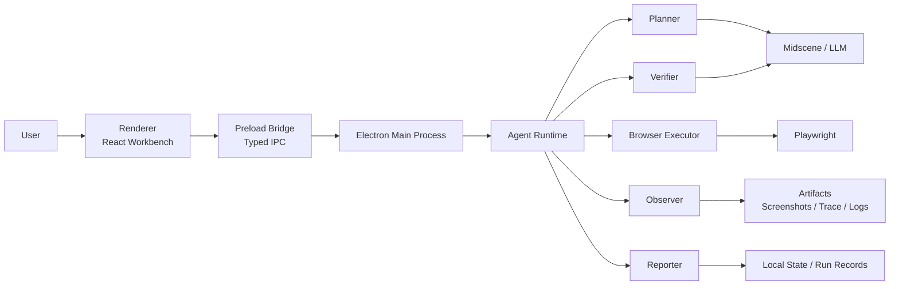

# 系统架构设计

## 1. 总体架构

PlayTest Pro 采用 Electron 多进程架构，最终目标是承载本地自动化测试 Agent。

Renderer 负责表达用户意图和展示结果；Main Process 负责密钥、文件、浏览器、模型和 Agent Runtime。



## 2. 进程职责

### 2.1 Renderer

Renderer 负责：

- 工作台 UI
- 启动屏
- 项目、分组、用例、录制、PRD、运行记录页面
- 设置弹窗
- 表单编辑
- 触发受控 IPC
- 订阅运行事件并展示

Renderer 不负责：

- 直接调用模型
- 直接调用 Playwright
- 直接读写敏感文件
- 直接持有长期密钥
- 执行 Agent 决策

### 2.2 Preload Bridge

Preload 只暴露白名单 API：

- `loadStudioState`
- `saveStudioState`
- `getRuntimeInfo`
- `startBrowserSession`
- `navigateBrowserSession`
- `captureBrowserSnapshot`
- `endSession`
- `sendChatCommand`
- `runWorkflow`
- `runTestCase`
- `loadRunDetail`
- `onRunEvent`
- `onRecordingEvent`

后续 Agent 化后建议新增：

- `runAgentIntent`
- `analyzePrdDocument`
- `planTestPaths`
- `verifyPageState`

### 2.3 Main Process

Main Process 负责：

- 应用生命周期
- IPC 注册
- 本地状态读写
- 凭证存储
- 浏览器 runtime
- Agent runtime
- 运行产物管理

## 3. Agent Runtime 分层

Agent Runtime 是后续最关键的工程边界。

建议模块：

```text
electron/runtime/
  agent-runtime.ts
  agent-planner.ts
  agent-executor.ts
  agent-observer.ts
  agent-verifier.ts
  agent-reporter.ts
  browser-runtime.ts
  test-runner.ts
  artifact-manager.ts
  credential-store.ts
```

### 3.1 Agent Runtime

职责：

- 接收用户意图。
- 读取项目、环境、凭证和 Midscene 配置。
- 调用 Planner 生成计划。
- 调用 Executor 执行步骤。
- 调用 Observer 采集现场。
- 调用 Verifier 判断结果。
- 调用 Reporter 写入运行记录。
- 通过事件流回传进度。

### 3.2 Planner

职责：

- 将自然语言、PRD 内容或录制路径转换为测试计划。
- 输出结构化步骤、断言和风险点。
- 对图表/表格页面生成更明确的观察点。

### 3.3 Executor

职责：

- 控制浏览器执行动作。
- 支持 navigate、click、input、wait、scroll、select、assert。
- 结合 Midscene 做语义定位。
- 对失败动作执行有限重试。

### 3.4 Observer

职责：

- 截图。
- 提取 DOM 摘要。
- 记录 URL、标题、选择器、事件。
- 收集 console/network 关键信号。
- 保存 trace 和运行产物。

### 3.5 Verifier

职责：

- 判断断言是否通过。
- 支持文本、DOM、表格、图表、视觉对比。
- 输出失败步骤、失败原因和证据。

### 3.6 Reporter

职责：

- 生成 RunSummary。
- 生成 RunDetail。
- 挂载截图、trace、日志和报告。
- 输出用户可读结论。

## 4. 当前已实现能力

当前代码已经具备：

- React 工作台壳层。
- 独立启动屏和 Midscene 配置引导。
- 项目、分组、环境、用例、录制、PRD、运行记录数据模型。
- 设置弹窗按 Midscene / runtime / network 等栏目组织。
- Electron 本地状态存储。
- Browser runtime 雏形。
- 录制事件订阅。
- 录制回放 runner 雏形。
- RunDetail / RunSummary 基础结构。

当前仍不足：

- `sendChatCommand` 和 `runWorkflow` 还未成为真正 Agent 执行链路。
- PRD 分析仍偏规则化。
- Verifier 和 Reporter 还不完整。
- Midscene 模型配置已存在，但真实调用层还需要落地。

## 5. 设置与启动屏架构

启动屏是应用级 onboarding，不是首页空态。

状态字段：

- `startupGuide.completed`
- `startupGuide.completedAt`
- `startupGuide.mode`

规则：

- 首次加载且未完成时显示启动屏。
- 用户跳过或完成配置后写入持久化状态。
- 后续加载不再自动显示。
- 进入依赖 Midscene 的功能时，如果配置不完整，设置弹窗默认定位到 Midscene 栏目。

## 6. 数据与产物存储

当前仍以本地状态为主，后续应逐步拆分。

推荐目录：

```text
studio-data/
  state.json
  projects/
  recordings/
  runs/
  artifacts/
    screenshots/
    traces/
    reports/
  credentials/
  config/
```

状态分层：

- App State：当前选择、启动引导、主题、运行时配置。
- Project Assets：项目、环境、分组、用例、录制、PRD。
- Run Records：运行摘要、运行详情、步骤日志。
- Artifacts：截图、trace、报告、快照。

## 7. Agent 事件流

后续 Agent 执行应采用结构化事件流。

建议事件：

- `agent:plan-created`
- `agent:step-started`
- `agent:browser-action`
- `agent:observation-created`
- `agent:assertion-result`
- `agent:artifact-created`
- `agent:step-failed`
- `agent:run-finished`

Renderer 只订阅并展示事件，不推断执行状态。

## 8. 安全边界

- `contextIsolation: true`
- `nodeIntegration: false`
- Renderer 不直接访问文件系统。
- Renderer 不直接调用模型。
- API Key 和凭证应由 Main Process 管理。
- 运行产物路径由主进程生成并白名单暴露。

## 9. 后续架构演进

优先级：

1. 新增统一 Agent Runtime contract。
2. 将自然语言测试接入 Agent Runtime。
3. 将 workflow runner 复用 Agent Runtime。
4. 将 PRD 路径生成接入 Planner。
5. 完善 Observer / Verifier / Reporter。
6. 将状态文件拆分为资产文件和运行产物文件。
