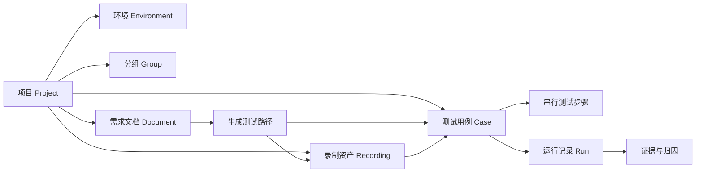

# TestBuddy 工作台 UI 设计交接稿

> 版本：2026-08-01  
> 面向对象：UI / UX 设计师、产品设计师、前端实现人员  
> 设计基线：当前桌面端 TestBuddy 已实现功能  
> 目标：将现有产品能力转化为可在 Figma 中继续设计、验收和扩展的交互规格。

## 1. 产品与设计目标

### 1.1 产品是什么

TestBuddy 是本地桌面端的 Web 自动化测试工作台。它不是传统测试管理后台，也不是代码编辑器。用户围绕一个被测项目，使用以下三种入口形成可执行的测试资产：

1. 以自然语言直接让 Agent 执行动作、断言或信息提取。
2. 在受控浏览器中录制真实操作路径，并回放、维护或转成测试用例。
3. 导入需求文档，生成测试路径草案，再转成测试用例或录制草稿。

最终，用户在运行记录中检查结果、失败原因和证据，并将有效路径持续沉淀为项目资产。

### 1.2 设计要解决的问题

设计应持续回答用户在每个界面的三个问题：

| 用户问题 | 应由界面提供的答案 |
| --- | --- |
| 我正在哪个工作空间操作？ | 当前项目、环境、资产来源和运行状态必须可见。 |
| 我现在能做什么？ | 页面主动作紧贴标题或当前上下文；不可执行的动作必须禁用或用引导状态替代。 |
| Agent 做了什么、为什么得出这个结论？ | 运行过程、断言、页面观察、截图、日志、产物和失败归因应可追溯。 |

### 1.3 核心设计气质

- 桌面工作台，而非营销首页或卡片瀑布流。
- 信息密度高，但通过层级、分栏、留白和字号组织，不依赖多层嵌套卡片。
- 白色为亮色主题的主体工作区背景；蓝色只用于当前选择、主动作和关键状态。
- 安静、克制、专业。流程、证据、数据和操作比装饰更重要。
- 所有状态应有明确的视觉语义，尤其是准备中、执行中、通过、失败和未配置。

### 1.4 不属于当前设计范围

- 用户账户、头像、登录、成员协作和权限管理。
- 云端测试调度、CI 编排、移动端真机矩阵。
- 虚构项目、虚构运行记录或演示数据作为默认空工作区内容。

## 2. 业务对象与关系

设计师应将“项目”理解为所有测试活动的必要上下文。除首页、项目页、设置外，其余资产均属于当前项目。



| 对象 | 用户可见内容 | 设计含义 |
| --- | --- | --- |
| 项目 | 名称、描述、默认 URL、状态、分组/环境/用例/资产数量 | 全局工作空间；所有项目型页面的前置条件。 |
| 环境 | Local、Staging、Production Mirror，URL、浏览器、视口、语言、无头执行、凭据 | 决定测试在哪里、以什么方式运行。 |
| 分组 | 业务线、页面簇或模块名称、说明 | 组织用例和录制资产；也是运行记录筛选与风险归因维度。 |
| 测试用例 | 名称、来源、类型、目标 URL、环境、步骤 | 主要可执行资产；中间区域应呈现为有开始和结束节点的串行流程。 |
| 测试步骤 | 动作、断言、提取、录制回放、人工检查 | 每一步必须可以被选择、编辑、重排、复制、删除或插入。 |
| 录制资产 | 录制来源、分组、环境、起始 URL、步骤时间线、对比配置 | 来自真实用户路径，可单独维护，也可作为用例步骤引用。 |
| 需求文档 | 文件/文本、摘要、覆盖域、路径草案、写入状态 | 从需求输入到可执行资产的转换中心。 |
| 运行记录 | 状态、耗时、步骤、日志、失败原因、截图、trace/报告/附件 | 结果中心，强调证据链而非单一成功/失败结论。 |

## 3. 信息架构和入口规则

### 3.1 侧栏导航

桌面端的一级导航固定在左侧，从上到下依次为：

1. 总览
2. 项目
3. 需求文档
4. 用例
5. 运行记录
6. 自然语言测试
7. 工作流
8. 录制回放
9. 设置

左上区域为应用 Logo 和 `TestBuddy` 名称，Logo 使用拿锤子的机器人图形。设置位于侧栏底部。应用不出现用户头像、用户菜单或登录入口。

### 3.2 功能门禁

| 情况 | 页面/动作表现 | 设计要求 |
| --- | --- | --- |
| 没有项目 | 需求文档、用例、工作流、录制回放显示项目引导状态 | 不展示可填写但无法保存的表单；提供“项目”主按钮，跳转至项目页。 |
| 没有当前用例 | 用例页保留页面标题，正文显示“选择或新建测试用例” | 提供新建用例按钮；不展示空编辑器。 |
| 没有当前录制资产 | 录制页保留受控浏览器区域和提示 | 运行回放按钮不可用；引导选择或创建录制。 |
| 未配置 MidScene，但进入依赖 Agent 的功能 | 打开设置弹窗并直接定位至 MidScene 分区 | 弹窗标题区域给出“缺少必要配置”状态；保存按钮显示“保存并继续”。 |
| 测试用例不满足执行条件 | 运行按钮禁用，标题下显示具体阻塞原因 | 原因可能是没有步骤、步骤标题为空、指令为空或录制引用丢失。 |

### 3.3 页面层级

```text
首次启动
  启动引导（MidScene 快速配置 / 跳过）

进入工作台
  总览（全应用）
  项目（全应用 + 当前项目配置）
  项目型工作区
    需求文档 → 路径草案 → 用例 / 录制草稿
    用例 → 运行记录
    自然语言测试 → 保存为步骤 → 用例
    工作流 → 用例 / 运行
    录制回放 → 用例 → 运行记录
```

## 4. 全局壳层和视觉规格

### 4.1 Desktop 主框架

设计以桌面端为第一优先级。建议在 Figma 使用 `1440 x 960` 作为主验收 Frame，同时保证 `1280 x 800` 仍能完成主要工作流。

| 区域 | 规格 | 内容与行为 |
| --- | --- | --- |
| 左侧导航栏 | 224 px 宽，固定高度 | 柔和浅灰/深色侧栏；Logo、一级导航、底部设置。导航项高度稳定，选中项有蓝色文字、浅蓝底和右侧 3 px 指示条。 |
| 顶部栏 | 56 px 高 | 左侧资源搜索输入框；右侧“连接设备”“项目设置”快捷操作。滚动正文时固定不动。 |
| 页面标题栏 | 最小 48 px 高 | 左侧仅一个一级标题；右侧先放状态 Tag/筛选，再放操作按钮。标题栏不出现第二层描述、小标题或大副标题。 |
| 页面正文 | 独立纵向滚动 | 使用紧凑页边距，避免浏览器页面级双滚动条。分栏工作台应固定外框，只让各个信息列在必要时内部滚动。 |
| 底部运行栏 | 桌面端可见 | 显示当前运行状态、基础运行信息；视觉弱于页面正文。 |

### 4.2 尺寸、圆角和密度

| Token | 建议值 | 使用场景 |
| --- | --- | --- |
| 页面横向内边距 | 12-20 px，自适应 | 所有主页面正文。 |
| 页面纵向内边距 | 8 px | 让编辑型工作台保持紧凑。 |
| 标准控件高度 | 32 px | 输入框、Select、常规按钮。 |
| 小控件高度 | 26 px | 次级操作、行内 Select。 |
| 大控件高度 | 36 px | 少量强调性主操作。 |
| 常规间距 | 8 px | 同一操作组、表单字段内。 |
| 区块间距 | 20 px | 同级业务区块。 |
| 圆角 | 4 px 控件，6 px 内部面板，8 px 主面板/弹窗 | 不使用大圆角胶囊作为常规组件。 |
| 滚动条 | 8 px | 仅在可滚动内容区显示，不能覆盖内容。 |

### 4.3 色彩与主题

| 语义 | 亮色主题 | 暗色主题 | 使用限制 |
| --- | --- | --- |
| 主工作区 | `#FFFFFF` | `#101827` | 不应再使用偏灰的页面主体背景。 |
| 次级面板 | `#F1F4F9` | `#1D2940` | 用于编辑区背景、分栏衬底和弱信息区。 |
| 主色 | `#0050CB` | `#62A0FF` | 主操作、选中、焦点、进度和关键链接。 |
| 主文本 | `#191B24` | `#EDF2FB` | 标题、正文、关键数值。 |
| 次文本 | `#697386` | `#9EABC2` | 说明、辅助字段、时间和元信息。 |
| 边界 | `#D8D9E6` | 16% 透明浅蓝灰 | 仅用于界定层级，不可形成密集表格线。 |
| 成功 | 绿色 | 浅绿色 | 仅用于通过、已就绪、已验证。 |
| 失败 | 红色 | 浅红色 | 仅用于失败、阻塞、危险删除。 |

亮色和暗色均需使用相同的蓝色主语义。Logo 需有亮底版和暗底版：亮色版以白色背景和应用蓝为主体，暗色版适配深色背景。

### 4.4 排版和图标

- 全应用使用统一无衬线字体族：Geist / Avenir Next / PingFang SC 等回退链。不要在标题、Tag、元数据之间混用不同字体。
- 一级页面标题：20 px、bold、单行截断；不要超过此等级放大。
- 区块标题：16-18 px、semibold；面板内部不可抢占页面标题的层级。
- 正文：14 px；控件文字：13 px；标签：12 px；元信息：11 px。
- 标签、状态、技术字段可用全大写或较大字距，但必须使用与正文相同的字体家族。
- 操作图标统一使用线性 Lucide 风格。只有图标能充分表达的功能使用 icon-only 按钮，需配 tooltip 和无障碍名称。

### 4.5 通用组件语义

| 组件 | 用途 | 状态与交互 |
| --- | --- | --- |
| 主按钮 | 创建、运行、保存并继续、确认删除 | 蓝底白字，带对应图标；加载时保留宽度并用 spinner 替换图标。 |
| 次按钮 | 筛选、导入、运行配置、设置 | 描边或弱底色；不与普通 Tag 长得相同。 |
| 图标按钮 | 删除、更多、添加流程等空间受限场景 | 固定正方形尺寸；hover 有弱背景；必须有 tooltip。 |
| Tag | 来源、数量、环境、状态、保存状态 | 紧凑、描边/低饱和底色、非按钮形态；除非明确可点击，否则没有 hover 交互。 |
| Status Pill | `准备中 / 执行中 / 通过 / 失败` | 4 px 圆角、11 px 字、状态色轻量表达；不是 CTA。 |
| Metric Tile | 数量、通过率、耗时、步骤数等 | 标题 11 px，数值 22 px；用于可扫读的少量关键指标。 |
| Evidence Card | 空状态、说明、证据摘要 | 只在无数据或需要解释时使用；允许一个明确下一步按钮。 |
| Surface | 主面板、次面板、激活面板、证据面板 | 不要在 Surface 内再套视觉相同的 Surface。 |

### 4.6 动效与反馈

- 页面切换：淡入并轻微向上移动，约 360 ms。
- 常规 hover / focus：160-240 ms，不使用缩放导致布局抖动。
- 执行中：状态 Tag、进度节点或 spinner 有持续但克制的变化。
- 保存成功：短暂显示“已保存” Tag，然后自动回到中性状态。
- 失败：不要只变红；需要在可见位置给出可读原因和下一步。
- 用户启用系统“减少动态效果”时，所有装饰与循环动效应被禁用。

## 5. 首次启动与空工作区

### 5.1 启动引导

**出现时机**：首次打开应用，且用户尚未完成或跳过引导。

**布局**：独立页面，不显示侧栏和顶部栏。左侧/上方是 3 步进度，主体分为能力说明和 MidScene 快速配置两部分。

| 区域 | 内容 | 交互 |
| --- | --- | --- |
| 步骤条 | `01 配置 MidScene`、`02 进入工作台`、`03 开始测试` | 当前步骤高亮，已完成步骤显示勾选。 |
| 能力说明 | PRD 分析、自然语言测试、操作录制三个能力块 | 只说明能力，不跳转页面。 |
| MidScene 快速配置 | Base URL、API Key、模型名、模型族、默认上下文 | API Key 为密码字段；必填完整后“保存并进入工作台”可用。 |
| 跳过 | 次级文本按钮 | 关闭引导进入工作台；后续进入 Agent 依赖页面时仍会触发配置门禁。 |

### 5.2 无项目首页

**目标**：让首次使用者知道项目是开始所有测试工作的第一步，而不是把它当成报表空白页。

**布局与内容**：

- 居中主引导区，高度约 330 px，不能做成占满屏幕的大型营销 Hero。
- 机器人图形、短标题、两行以内说明和“创建项目”主按钮。
- 下方三个可点击能力预览：PRD 分析、自然语言、录制回放。点击后进入相应功能页；如果仍无项目，功能页继续显示项目引导，不可进入无效编辑状态。
- 底部展示本地桌面、可审计、可接入后续流水线等静态能力信号。

### 5.3 项目型页面的统一空状态

适用于：需求文档、用例、工作流、录制回放。

```text
页面标题


            [ 尚未选择项目 / 选择一个项目 ]
            先创建或选择一个项目，再开始……
                                   [ 项目 ]
```

- 卡片居中于可用工作区，不贴在左上角。
- 主按钮进入项目页。
- 不显示上传框、流程列表、浏览器舞台、可运行按钮或其它不可保存的表单。
- 页面保留标题，帮助用户确认自己原本想进入的功能。

## 6. 页面规格

### 6.1 总览

**定位**：全应用信息总览，数据不应仅来自某一个当前项目。

**主要信息**：项目数量、用例数、录制数、需求文档数、生成路径数、最近运行数量、通过率、覆盖指数、当前健康信号。

**布局**：

1. 顶部为单层标题“总览”。
2. 第一行使用 5-6 个紧凑统计块，不做“管理项目”按钮，也不重复展示项目数量。
3. 第二行左侧为“测试资产路径”：以 PRD、自然语言、录制回放三项作为入口，并可查看运行记录。
4. 第二行右侧为最近运行与健康信号。
5. 下方可展示风险提醒、资产优化建议和运行趋势，但避免长日志。

**交互**：

- 点击路径入口进入对应工作区。
- 点击最近运行进入运行记录并定位到该运行。
- 没有运行记录时，健康信号显示“数据不足”，不得伪造成功率。

### 6.2 项目

**定位**：管理全部项目，以及编辑当前项目的基础配置。

**页面主体**：

| 区域 | 设计内容 | 交互 |
| --- | --- | --- |
| 页面标题右侧 | “新建项目”主按钮 | 创建新项目，并立即切换为当前项目。 |
| 汇总指标 | 用例、分组、环境、资产总量 | 全部项目范围统计。 |
| 项目卡片网格 | 图标、名称、简介、状态 Tag、分组/用例/资产计数、环境数 | 点击卡片切换当前项目；卡片底部有管理与删除操作。 |
| 新建项目卡 | 与项目卡同尺寸的虚线/弱面板入口 | 点击创建项目。 |
| 无项目提示 | 说明项目用途 | 与创建入口并存。 |

**项目配置弹窗**：点击“管理”打开，不在项目页堆叠长表单。

- 顶部：项目名称、描述、默认 URL。
- 分组：列表、选中态、名称/说明编辑、新建和删除。删除分组时必须提示其资产会迁移至可用兜底分组。
- 环境：名称、类型、URL、入口路径、浏览器、视口、语言、无头执行、关联凭据。环境是测试运行上下文，不宜用简单 Tag 代替表单。
- 凭据：标签、用户名、密钥；密钥输入必须遮罩。保存后页面只显示凭据引用/标签，不回显密钥。
- 删除项目：危险样式、二次确认；确认文案包含项目名称。

### 6.3 需求文档分析

**定位**：从需求输入生成可审阅的测试路径，而不是简单文件上传页。

**布局**：桌面端为 `主资产区 + 右侧输入/检查器` 双栏。

| 区域 | 内容 | 交互 |
| --- | --- | --- |
| 标题栏 | 文档数、路径数、已写入覆盖数 Tag | 这些是状态，不可设计成按钮。 |
| 资产区顶栏 | 文档/已分析/路径汇总，筛选、排序 | 筛选与排序为次按钮。 |
| 文档卡片 | 类型/分析状态、名称、摘要、字符数、生成路径数 | 点击切换当前文档；选中态用蓝色边界或背景表达。 |
| 右侧输入区 | 文档名、原始文本、多格式上传、分析生成路径 | 支持文本、Markdown、文字型 PDF；文件读取成功/复杂 PDF 提示应显示在输入区。 |
| 右侧检查器 | 覆盖域、路径数、已写入数量、每条路径 | 路径支持写入用例、写入录制草稿；全部写入只在存在未写入路径时可用。 |

**路径卡片必须展示**：优先级（P0/P1/P2）、标题、目标分组、生成理由、步骤摘要、是否已经有用例、是否已经有录制草稿。已覆盖与已有录制是不同状态。

**关键状态**：

- 无项目：显示项目引导，完全隐藏输入表单。
- 无文档：资产区显示“暂无文档”，右侧仍可输入和上传。
- PDF 无可提取文本：显示可理解的提示，保留用户可编辑的文本区。
- 分析完成：文档卡状态更新，检查器自动显示新路径。

### 6.4 用例工作台

**定位**：将测试用例呈现为可视化的串行流程，而不是表格式步骤列表。

**布局**：左侧为流程编排主区域，右侧为选中步骤属性编辑器。

```text
标题：用例工作台                    [用例选择器] [来源 Tag] [运行状态] [保存状态] [用例设置] [添加步骤] [运行]

┌──────────────────────────────────────────┬──────────────────────────┐
│                  开始 ○                    │ 步骤属性                 │
│                    │                       │ 类型 Tag                 │
│              插入位置 / +                 │ 标题、指令、专属字段     │
│                    │                       │                          │
│          [ 01  步骤卡片 ]                  │ 录制绑定 / 人工检查说明  │
│                    │                       │                          │
│          [ 02  步骤卡片 ]                  │                          │
│                    │                       │                          │
│                  结束 ●                    │                          │
└──────────────────────────────────────────┴──────────────────────────┘
```

**标题栏内容**：

- 用例选择器：用于切换当前项目内用例。
- 来源 Tag：手工、自然语言、录制、PRD、Reporter 修复草稿。
- 运行 Status Pill。
- 保存中/已保存/保存失败 Tag；失败时显示单独的重试保存图标按钮。
- 用例设置、添加步骤、运行用例。

**流程交互**：

| 操作 | 结果 |
| --- | --- |
| 点击步骤卡 | 选中该步骤，右侧检查器更新；选中卡片在流程中清晰高亮。 |
| 点击任意插入位 | 打开步骤类型菜单，以当前索引插入。 |
| “添加步骤” | 在流程末尾插入，使用同一个步骤类型菜单。 |
| 拖动步骤把手 | 显示可投放插入位；只能从把手开始拖动，避免误拖整张卡。 |
| 放入插入位 | 重新排序；放回原位置不产生保存或跳动。 |
| 更多菜单 | 上移、下移、复制、删除。 |
| 删除 | 弹出确认对话框；确认后选中相邻步骤。 |
| 编辑右侧字段 | 自动保存；成功/失败状态在标题栏反馈。 |

**步骤类型与检查器**：

| 步骤类型 | 检查器字段/反馈 |
| --- | --- |
| 动作 | 标题、自然语言操作指令。 |
| 断言 | 标题、期望页面状态或业务结果。 |
| 提取 | 标题、需要从页面提取的数据描述。 |
| 录制回放 | 绑定录制资产；展示录制名称、分组、环境和步骤数。若资产被删除，显示“需要重新绑定”，并阻止运行。 |
| 人工检查 | 标题、检查说明；运行时可附加截图和文件证据，并标记人工通过/失败。 |

**用例设置弹窗**：编辑用例名称、类型、分组、执行环境、目标 URL、备注。此类用例级字段不得塞进右侧单步骤检查器。

### 6.5 自然语言测试

**定位**：即时探索与验证页面，适合先试验，再把有效指令保存为用例步骤。

**布局**：三栏工作台，左为命令会话，中为受控浏览器舞台，右为 Agent 运行观察/上下文。

| 区域 | 内容 | 交互 |
| --- | --- | --- |
| 标题栏 | 当前模式、环境、会话状态 Tag；启动/停止会话 | 运行或发送中禁用会话切换。 |
| 左侧命令区 | 动作/断言/提取三段 Tab、环境 Select、深度思考/深度定位开关、对话时间线、输入框 | 切换 Tab 会改变本次指令类型；发送按钮固定在输入框右下。 |
| 中间舞台 | 浏览器栏、当前 URL、页面截图或空态、Agent 执行阶段 | 截图应以真实页面为核心，不用纯装饰浏览器图。 |
| 右侧观察区 | 当前计划、执行步骤、上下文、最近结果 | 不只显示文本日志；计划、执行、观察、验证应能分别辨认。 |

**会话与指令交互**：

1. 用户选择环境和指令模式。
2. 用户可开启“深度思考”或“深度定位”，它们是独立复选开关，不是普通按钮。
3. 点击“启动会话”后会话状态从待命变为活跃。
4. 输入自然语言并点击发送，发送期间禁止重复发送。
5. Agent 产生用户消息、系统消息和运行消息；用户消息靠右，系统/运行消息靠左。
6. 用户可将当前有效 Prompt 保存为用例步骤；保存后应该给出资产已创建/已写入的反馈。

### 6.6 工作流

**定位**：面向可回归执行的轻量流程维护。它与用例工作台共用项目中的测试资产，但提供更简化的线性流程编辑视图。

**布局**：`中间流程编辑器 + 右侧流程库和运行配置`。

| 区域 | 内容 | 交互 |
| --- | --- | --- |
| 标题栏 | 新建流程、运行当前流程 | 无项目时两者不显示，改为项目引导。 |
| 编辑器头部 | 分类 Tag、步骤数/浏览器元信息、流程名称、说明、添加步骤、运行 | 名称和说明是可编辑资产信息。 |
| 流程配置 | 可折叠区：名称、业务标签、目标 URL、备注 | 默认收起，避免挤压步骤编排。 |
| 步骤序列 | 编号节点、标题、动作/断言/提取类型 Select、指令、同类型新增、删除 | 每一步沿纵向连接，反映串行顺序。 |
| 流程库 | 流程列表、新建图标按钮、流程类型、分类、步骤数 | 点击条目切换选中流程。 |
| 运行配置 | 当前状态、日志数、Base URL、浏览器选择、最近三行日志 | 修改 Base URL/浏览器立即影响后续运行。 |

**关键状态**：无项目时显示居中项目引导；有项目但无流程时流程库和编辑器各显示对应空状态，新建流程仍可用。

### 6.7 录制回放

**定位**：采集、维护和回放真实用户路径，并形成可复用的测试资产。

**布局**：`中央受控浏览器与录制舞台 + 右侧录制资产列表及步骤编辑`。页面必须把“当前录制是否正在进行”“回放是否正在运行”“浏览器状态”放在明确位置。

**标题栏**：录制资产数、当前录制步骤数、浏览器状态 Tag；右侧为“启动录制器”“运行回放”“导入回放”。运行期间相关按钮禁用并显示执行中。

| 区域 | 内容 | 交互 |
| --- | --- | --- |
| 浏览器舞台 | 受控浏览器状态、当前 URL、截图、启动/导航/快照 | 需要项目和环境才能启动；忙碌时禁用操作。 |
| 录制资产列表 | 名称、来源、摘要、分组、环境、标签、步骤数、更新时间 | 点击选择；可新建、导入、删除。 |
| 录制属性 | 名称、摘要、分组、环境、起始 URL、回放比较目标、标签 | 编辑自动保存；关联 Select 必须反映项目中的真实分组和环境。 |
| 时间线 | 跳转、点击、输入、等待、核对、快照六种步骤 | 每项可编辑标题、类型、详情；展示页面 URL、采集时间、截图已保存等元信息。 |
| 视觉回归设置 | 差异阈值、动态区域遮罩 | 阈值为百分比输入；遮罩需要能新增、编辑、删除，且反映相对于截图的区域。 |
| 转换出口 | “创建测试用例” | 以当前录制生成可维护的录制回放用例。 |

**录制与回放流程**：

1. 用户创建或选中录制资产，配置分组、环境和起始 URL。
2. 点击启动录制器，打开受控浏览器会话。
3. 页面跳转、点击、输入会自动记录到步骤时间线；用户可补充等待、核对和快照。
4. 用户可捕获当前截图，或配置忽略动态区域。
5. 点击运行回放，系统按时间线执行；执行中按钮禁用，步骤/日志/截图逐步更新。
6. 通过“创建测试用例”将录制作为用例的回放步骤沉淀。

### 6.8 运行记录

**定位**：运行结果和证据分析中心。视觉重点是“为什么失败/如何复现”，不只是仪表盘。

**布局**：标题栏 + 高密度概览 + 左侧运行列表/筛选 + 中央详情 + 右侧证据链或分析区。具体分栏可随窗口宽度调整，但运行选择与详情必须同时可见。

**标题栏和总览**：

- 标题右侧显示当前运行状态、筛选状态或必要操作。
- 指标至少包含总运行数、失败数、健康状态；详情内再显示当前状态、耗时、步骤数、产物数。
- 风险分组、风险环境、失败原因聚合、失败趋势可作为二级洞察区。

**运行列表**：

| 信息 | 交互 |
| --- | --- |
| 名称、状态、环境、分组、耗时、开始时间、摘要 | 点击行切换详情；选中行以活跃背景和清晰边界区分。 |
| 状态 / 分组 / 环境筛选 | Select 或紧凑筛选控件；筛选结果为空时显示说明。 |
| 重新运行 | 对应原测试用例与环境仍存在时可执行；否则显示不可重新运行原因。 |

**详情区的内容顺序**：

1. 当前运行摘要、状态、时间、失败原因。
2. 与可比较历史运行的差异：步骤状态变化数、产物变化数。
3. Agent 过程：Planner、Executor、Verifier、Reporter 等事件时间线。
4. 选中事件的证据链：页面观察、断言/验证依据、浏览器状态、关联产物。
5. 截图预览、trace、报告、附件的打开与导出操作。
6. 步骤级结果。人工检查步骤要展示确认状态、说明、截图和附件。

**失败后的恢复动作**：

- 重新运行原用例。
- 打开或导出产物。
- 从 Reporter 建议创建“修复草稿”用例。草稿保留原用例步骤并追加修复建议，来源 Tag 显示 Reporter。
- 人工检查可在此附加当前浏览器截图或本地文件，再确认通过/失败。

### 6.9 设置弹窗

**定位**：全局配置中心与 MidScene 依赖功能的门禁入口。它是居中模态，不应再设计成完整页面。

**Frame 规格**：桌面端约 `860 x 640 px`，最大化不超过主窗口的大部分面积。顶部固定 52 px，左侧分区导航 192 px，右侧内容纵向滚动，底部操作条固定。

**弹窗结构**：

| 区域 | 内容与交互 |
| --- | --- |
| 顶部 | 设置图标、标题、短说明、配置状态 Tag、关闭图标。 |
| 左侧导航 | 通用、MidScene、Agent 模型、执行环境。选中项左侧蓝色 4 px 指示条。 |
| 内容区 | 当前分区唯一展开；分组标题使用编号/短标签 + 分隔线，不堆叠大量卡片。 |
| 底部 | 关闭次按钮、保存设置主按钮。若从被门禁功能进入，主按钮文案为“保存并继续”。 |

**分区内容**：

| 分区 | 字段与交互 |
| --- | --- |
| 通用 | 浅色 / 深色 / 跟随系统三种主题预览选择；中文 / English / 跟随系统语言选择。选中态是小型选择卡或段控件。 |
| MidScene | Base URL、API Key、模型名称、模型族、首选语言、重新规划循环上限、HTTP 代理、默认上下文。API Key 遮罩。配置完整后可点击“测试连接”。 |
| MidScene 测试连接 | 点击后按钮进入 loading；结果以行内 status 呈现：成功展示耗时，失败区分配置、HTTP、网络和响应异常。此操作会真实调用模型端点，设计上需让用户明确知道。 |
| Agent 模型 | Planner、Executor、Verifier、Reporter 列表。每一项可启用/禁用、展开；展开后选择“复用 MidScene”或“OpenAI 兼容模型”，并配置模型和温度。 |
| 执行环境 | Chromium / Firefox / WebKit 选择；Desktop / Laptop / Mobile 视口；浏览器语言；无头执行开关；默认基础 URL。 |

## 7. 关键跨页流程

### 7.1 从零开始创建并运行用例

1. 用户从无项目首页点击“创建项目”。
2. 项目卡出现并成为当前项目；用户在项目配置中维护分组和环境。
3. 用户进入用例页，新建用例。
4. 用户在流程的插入位选择步骤类型，逐步编辑右侧属性。
5. 当用例完整时，运行按钮可用；运行中状态进入标题和底部运行栏。
6. 自动跳转或可进入运行记录，查看步骤、截图、验证和失败归因。

### 7.2 从需求文档到测试用例

1. 用户先选择项目，再进入需求文档分析。
2. 用户上传文件或粘贴文本，填写名称并点击分析。
3. 生成路径出现在选中文档检查器；用户检查优先级、理由和步骤。
4. 用户对单条路径点击“创建用例”，或使用“全部写入用例”。
5. 已写入状态即时更新；用户转到用例工作台进行串行步骤微调。

### 7.3 从真实操作到回放用例

1. 用户在录制回放页创建资产并选择环境。
2. 启动受控浏览器并完成业务操作。
3. 时间线自动记录，用户补充等待、核对、快照或动态遮罩。
4. 用户先运行回放验证稳定性。
5. 用户点击“创建测试用例”，生成带录制回放步骤的用例。
6. 后续从用例或运行记录中执行与追踪。

### 7.4 探索式自然语言测试到资产沉淀

1. 用户在自然语言页选择动作、断言或提取模式，选择目标环境。
2. 启动会话，发送自然语言测试目标。
3. 观察 Agent 的计划、执行、浏览器页面和结果。
4. 有效指令点击“保存为步骤”。
5. 用户进入用例工作台，将步骤放入完整流程，补充其它断言或回放步骤。

### 7.5 失败分析与修复草稿

1. 用户在运行记录筛选失败运行并选择详情。
2. 用户通过步骤结果和证据链定位问题，查看截图、页面观察和失败原因。
3. 可重新运行、导出证据，或将 Reporter 建议生成修复草稿。
4. 修复草稿自动进入用例工作台，用户编辑、保存并再次执行。

## 8. 状态、禁用和错误反馈规范

| 场景 | 正确表现 | 错误做法 |
| --- | --- | --- |
| 异步保存 | 标题栏显示“保存中”，完成后短暂显示“已保存” | 静默保存，无任何反馈。 |
| 保存失败 | 标题栏显示“保存失败”并给出重试图标 | 继续显示已保存，或让用户重新输入。 |
| 运行中 | 所有会重复触发同一执行的按钮禁用，按钮文案/Tag 显示执行中 | 允许连续多次点击运行。 |
| 不满足运行条件 | 禁用运行按钮，紧邻显示具体阻塞原因 | 运行后才报泛化错误。 |
| 空数据 | 使用该页面上下文相关的 Evidence Card | 大面积空白、孤立提示文字或默认演示数据。 |
| 危险删除 | 红色确认按钮，确认对话框说明影响对象 | 单击立即永久删除。 |
| 真实外部调用 | 连接测试、Agent 运行、浏览器启动应有 loading/执行状态 | 视觉上与本地筛选等即时操作无差别。 |

## 9. 响应式、可访问性与验收细节

### 9.1 响应式规则

- `>= 1280 px`：使用完整三栏/双栏工作台。
- `1024-1279 px`：工作流、文档等双栏可缩为上下分区；仍需保持内容关系和可见的主要操作。
- `< 1024 px`：隐藏桌面侧栏，使用紧凑顶部导航；分栏工作台堆叠。设置弹窗左侧导航切换为可横向滚动的顶部 Tabs。
- 任何断点下，正文文字不得被滚动条遮挡；固定工具栏和内容区要有清晰边界。

### 9.2 键盘与无障碍

- 所有图标按钮必须有可读名称和 tooltip。
- Tab 顺序先标题操作，再正文主要操作，最后次级列表与详情。
- 选中流程步骤、选择运行、切换项目等状态需同时具有颜色、边界/图标和可读文本，不能仅靠颜色。
- 焦点态统一为蓝色 2 px 外描边，不能被裁切。
- 弹窗打开后焦点进入弹窗，关闭后回到触发它的控件。
- 动态状态使用可访问状态文本；例如连接测试结果、保存状态、项目引导状态。

### 9.3 Figma 交付建议

请至少建立以下页面/组件：

1. `00 Foundations`：颜色、字号、间距、圆角、阴影、图标尺寸、亮暗主题变量。
2. `01 App Shell`：Desktop、1280、1024 以下三种壳层。
3. `02 Components`：按钮、Tag、Status Pill、Metric Tile、Surface、空状态、列表行、浏览器面板、确认弹窗。
4. `03 Pages`：启动、无项目首页、有项目总览、项目、需求文档、用例、自然语言、工作流、录制回放、运行记录。
5. `04 Settings`：四个分区和 MidScene 连接的 idle/loading/success/failure 状态。
6. `05 Flows`：项目创建、PRD 转用例、录制转用例、运行失败与修复草稿。

## 10. 设计验收清单

- [ ] 不存在用户头像、账户入口或登录页面。
- [ ] 亮色主题的所有主体工作区均为白色，不混入旧的灰色页面背景。
- [ ] 每个功能页都有单层标题；按钮和状态在标题同行右侧。
- [ ] Status Tag 与按钮形态明显不同，Tag 不误导为可点击操作。
- [ ] 无项目时，需求文档、用例、工作流、录制回放都有居中引导和“项目”入口。
- [ ] 用例编辑中央区域清晰表现为“开始 → 串行步骤 → 结束”的流程，右侧只编辑选中步骤。
- [ ] 流程步骤支持插入、拖动排序、上下移动、复制和删除；删除有确认。
- [ ] 录制页面可清楚区分“录制资产”“受控浏览器”“时间线”“视觉回归设置”“转用例”。
- [ ] 运行详情可从结论追溯到步骤、页面观察、验证、截图和产物。
- [ ] 设置保持 `860 x 640 px` 左右的紧凑弹窗结构，而不是全屏设置页。
- [ ] 暗色主题不是简单反色：主色、文本、边界、面板层级和 Logo 均有适配。
- [ ] 所有重要 loading、成功、失败、禁用和空状态都有设计稿。

## 11. 参考实现

- 全局壳层与页面基础组件：[src/components/workbench.tsx](../src/components/workbench.tsx)
- 主题与密度 token：[src/index.css](../src/index.css)
- 业务页面：[src/features](../src/features)
- 运行状态与项目数据模型：[shared/studio.ts](../shared/studio.ts)
- Agent 事件和证据数据模型：[shared/agent.ts](../shared/agent.ts)
- 近期 UI 巡检与已修复问题：[ui-ux-audit-2026-08-01.md](./ui-ux-audit-2026-08-01.md)
